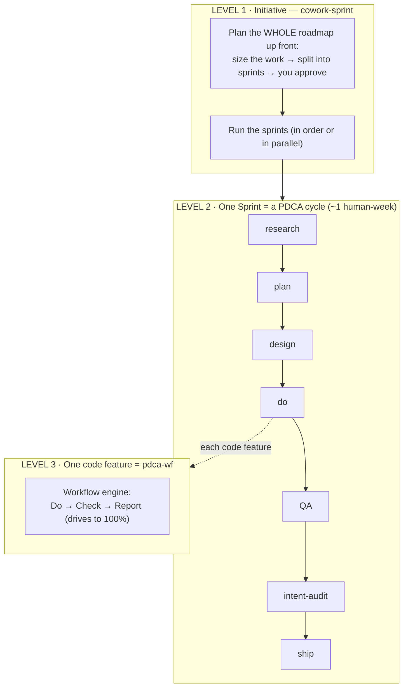
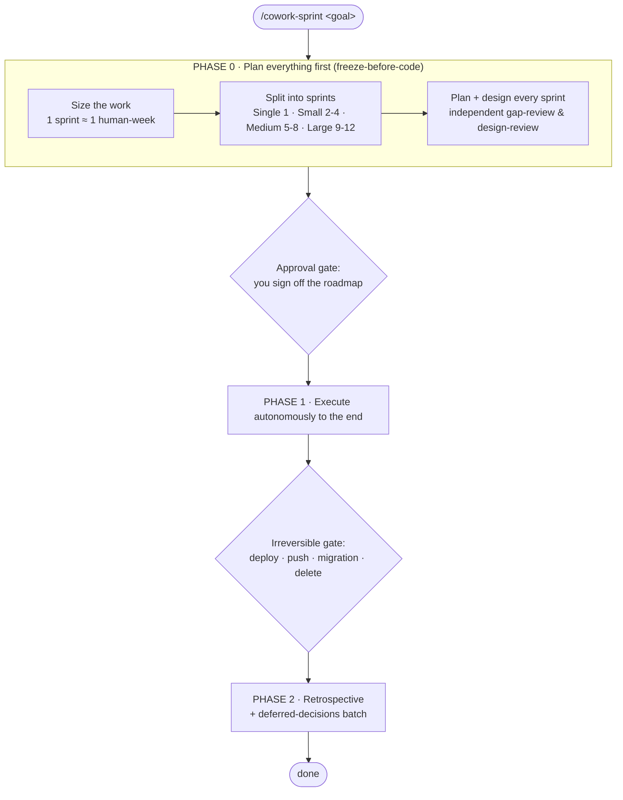
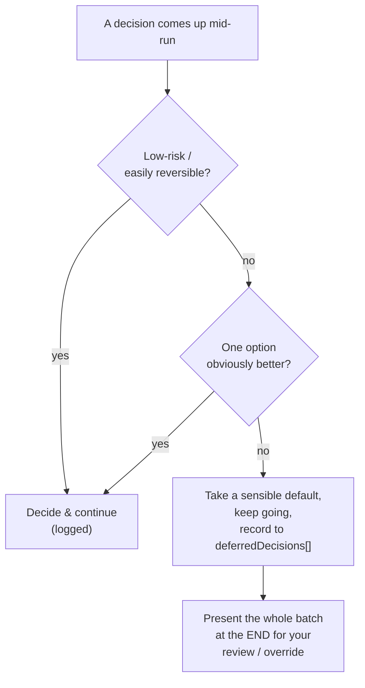

# ai-native-cowork

> **The work-collaboration harness for Claude Code.** Your AI sessions already hold the
> full story of how the work got done — ai-native-cowork turns that history into shareable
> reports and per-commit directive logs your whole team can learn from.

You shipped a week of work with Claude. Friday comes — what did you actually do, what
worked, and *why* did each commit happen? The transcripts know. Nothing else does.

**ai-native-cowork reads your own session history and gives the answer back** — as a polished
report, and as a verbatim record attached to every commit. No new note-taking. No
standup busywork. It runs entirely on data you already have.

| Capability | What you get | Status |
|------------|--------------|:------:|
| **`/cowork-insights`** | Narrative HTML + Markdown report of any time range — key prompts verbatim, per-session assessment, tool/token/cost charts. Paste into Jira, Notion, Slack. Weekly/monthly reviews. | ✅ shipped |
| **`/cowork-commit`** | Two artifacts in one commit: ① `<details>` recap block in the commit message (key decision quotes + metrics) ② directive-log file under `docs/commit-log/` — conversation log first (cause), recap second (result). `--language` option for recap language. Backfill mode documents past commits. | ✅ shipped |
| **`/cowork-sprint`** | Plan-then-execute sprint orchestrator: you co-plan the whole roadmap, then it runs each sprint through research→plan→design→do→QA→**intent-audit**→deploy autonomously. **Discovers or scaffolds purpose-fit agents** instead of defaulting to `general-purpose` — so every sprint grows your reusable agent roster. | ✅ shipped |
| **`/cowork-doc-sync` + `/cowork-doc-init`** | Keep `docs/` aligned to current reality: numbered taxonomy (00-reference…99-misc), LIVING/FROZEN status labels, cross-session drift replay. | ✅ shipped |
| **www-wiki / taise integration** | When the **www-wiki** vault or **taise** harness is installed, cowork-insights output and directive logs file themselves into your knowledge base. Standalone otherwise. | 🛠 planned |

## Why it's different

Most "AI usage" tools count tokens. ai-native-cowork preserves **the prompts, verbatim** — the
actual decisions, pivots, and root-cause insights — because that's the part a teammate can
learn from. It's a clean-room reimplementation of Claude Code's internal `insights`, with
date ranges, per-session assessments, cost ROI, multi-language output, and Markdown built
for sharing. Reports render from a **template engine** (LLM produces structured JSON, the
engine renders HTML+MD), so output is consistent and fast — not LLM-written HTML.

Origin: built in a single Claude Code session, validated across 3 A/B evaluation iterations
against the original `insights` command (95 sessions, 5,943 messages, 4.6B tokens of real
collaboration history).

## Your agent legion compounds

ai-native-cowork is built on one bet: **don't reach for `general-purpose` — reach for the right
specialist, and if it doesn't exist yet, build it.** Whenever cowork needs a role (reviewer,
researcher, migrator, auditor…), it first **discovers** an existing agent — project
`.claude/agents/` → user `~/.claude/agents/` → every installed plugin — and only **scaffolds** a
new project-local agent when there's no fit. Each scaffolded agent is version-controlled and
discoverable the next time.

The payoff is **compounding**: the longer you work, the larger and sharper your *personal agent
legion* gets. Week one you have a handful; a month in you have a roster tuned to your exact stack
and domain — reused, not re-derived. The plugin ships one fixed member to start
(`cowork-intent-auditor`, a fresh-perspective auditor that checks work against its *intent*, not
just the literal plan) and grows the rest alongside you.

## Install

**Via ww-w-ai marketplace (recommended):**

Run these two slash commands in Claude Code — one after the other:

```
/plugin marketplace add ww-w-ai/marketplace
/plugin install ai-native-cowork@ww-w-ai
```

That's it. (`@ww-w-ai` disambiguates if you have multiple marketplaces; `/plugin install ai-native-cowork` alone works too.)

**Or via settings.json:**

```jsonc
// ~/.claude/settings.json
{
  "extraKnownMarketplaces": {
    "ww-w-ai": {
      "source": { "source": "github", "repo": "ww-w-ai/marketplace" }
    }
  },
  "enabledPlugins": {
    "ai-native-cowork@ww-w-ai": true
  }
}
```

Restart Claude Code — the plugin downloads automatically.

**Local checkout (development):**

This repo is a plugin, not a marketplace, so install it through the local
marketplace clone:

```bash
git clone https://github.com/ww-w-ai/marketplace.git
```

```
/plugin marketplace add /absolute/path/to/marketplace
/plugin install ai-native-cowork
```

To hack on the plugin itself, point the marketplace clone's `ai-native-cowork`
entry at your local checkout, or symlink `skills/` and `agents/` into
`~/.claude/`.

**Requirements:** [Claude Code](https://claude.ai/claude-code) v2.1.71+ · [Bun](https://bun.sh) (TypeScript engine).

## Usage

```
/cowork-insights                                    # All time, current project
/cowork-insights --from 1w                          # Last 7 days (exact 168h)
/cowork-insights --from 2026-04-01 --to 2026-04-07  # Date range
/cowork-insights --from 1m --scope all              # Last month, every project
/cowork-insights last week, all projects, in plain English  # Natural language, any language
/cowork-commit                             # Recap + directive log in your next commit
/cowork-commit --language ko               # Recap in Korean (default: conversation language)
/cowork-commit backfill                    # Document past commits retroactively
```

Three report formats — **full** (deep weekly/monthly review), **standard** (mid-week
check-in), **minimal** (daily standup). Auto-selected by volume: 20+ sessions → full,
1–19 → standard.

### Date range

Relative (`1d`, `7d`/`1w`, `2w`, `1m`) = exact duration from now. Absolute
(`2026-04-01`) = midnight in `--tz` (default `Asia/Seoul`).

### Scope & filtering

| Flag | Values | Description |
|------|--------|-------------|
| `--scope` | `default` / `with-subfolder` / `all` | Scan scope (default = current folder) |
| `--path` | folder (repeatable) | Include specific folders |
| `--exclude-path` | string (repeatable) | Skip private/personal projects |
| `--tz` | IANA zone | Timezone for dates + display |
| `--exclude-subagents` | flag | Exclude sub-agent sessions |

## How it works

```
/cowork-insights --from 1w --scope all
        │
        ▼
  [1] Engine scans ~/.claude/projects/ for session JSONL (streaming, on disk)
  [2] Extracts metrics: tools, languages, tokens, lines, response times
  [3] Parallel sub-agents read uncached transcripts → structured "facets"
  [4] LLM produces NarrativeData JSON from facets + metrics
  [5] Template engine renders HTML + Markdown
  [6] Reports saved to ~/.claude/recap-reports/
```

The engine reads transcripts **from disk** — your conversation context is never bloated by
raw JSONL. Facets are cached in `~/.claude/recap-data/` and double as long-term history:
trends survive even after the original session files are deleted.

## Inside `/cowork-sprint`

`/cowork-sprint` works like a real delivery team: **plan the whole roadmap first, then execute every sprint to the end autonomously** — pausing only for the few things it must not decide alone.

### Mental model — one PDCA shape, nested three levels deep

The same *plan → do → check → act* loop repeats at three grain sizes. Judgment lives at the top; mechanical execution is delegated downward.



- **Initiative** — splits the goal into sprints and runs them.
- **Sprint** — each sprint is its own PDCA cycle, sized at ~1 human-week.
- **Feature** — a code feature's build is delegated to `/pdca-wf`, a Workflow-driven PDCA. Non-code sprints (marketing, research, ops) skip this level and execute directly.

### End-to-end flow



Nothing is coded until the roadmap is planned **and approved**. After that it runs to completion — the only hard stop is an irreversible action.

### One sprint's cycle — who does what

```mermaid
flowchart LR
  research --> plan --> gapR["gap-review"] --> design --> desR["design-review"] --> do --> QA --> fix --> intent["intent-audit"] --> commit --> adv["adversarial review"] --> deploy
  classDef main fill:#dbeafe,stroke:#2563eb,color:#1e3a8a;
  classDef mech fill:#e5e7eb,stroke:#6b7280,color:#111827;
  class research,plan,design,intent,adv main;
  class do,QA,fix mech;
```



> **Blue** = the **main session** (Opus, thinking ON) — judgment: plan, design, adversarial review before anything irreversible.
> **Gray** = delegated to **Sonnet subagents / Workflow** (thinking OFF) — mechanical: coding, QA, fixes.
> `gap-review` / `design-review` are dispatched as **independent fresh-context reviewers** — their value is a second pair of eyes on the plan, not model depth (so a cheaper model suffices).

### Sizing — 1 sprint = ~1 human-week (enforced)

A sprint is **one human-week of work for a normal team** — the unit of planning, not wall-clock. The sprint count is *derived from the estimate*, never a lazy default:

| Tier | Effort | Sprints |
|---|---|---|
| **Single** | ~1 week | 1 |
| **Small** | ~2–4 weeks | 2–4 |
| **Medium** | ~5–8 weeks | 5–8 |
| **Large** | ~9–12 weeks | 9–12 |

Beyond ~12 sprints, split into multiple roadmaps. Sizing is a **mandatory check at plan review** — an over-large sprint is split, a trivial one merged, *before* execution.

### Autonomy — decide the obvious, defer the ambiguous

While it runs (e.g. overnight), it never interrupts you for a *decision*:



Ambiguous or important-but-reversible calls are made with a sensible default and **collected into a batch you review at the end** — never pinged mid-run. Clarifying questions are asked **once, up front**, at the approval gate. Only irreversible/outward actions pause for your explicit go.

## Architecture

```
ai-native-cowork/
├── .claude-plugin/plugin.json   # Plugin manifest
├── manifest.json
├── skills/
│   ├── cowork-insights/SKILL.md     # /cowork-insights — narrative report pipeline
│   └── cowork-commit/
│       ├── SKILL.md             # /cowork-commit — recap + directive log + backfill
│       └── references/
│           └── commit-log-format.md  # Verbatim transcription template
├── src/                         # Bun + TypeScript engine
│   ├── cli.ts                   # CLI entry (scan, summarize, cowork-commit, commit-log, prepare-facets, render-report)
│   ├── commit-log.ts            # Directive extraction: buildTurns, synthetic filters, reactive pairing
│   ├── commit-log.test.ts       # 16 unit tests (bun:test)
│   ├── session-scanner.ts       # Streaming JSONL parser, path matching, date filtering
│   ├── recap-engine.ts          # Pipeline orchestrator
│   ├── metrics-extractor.ts     # Token / tool / cost / concurrency extraction
│   ├── facet-cache.ts           # Facet + meta cache (stale detection)
│   ├── html-report.ts           # Template engine (JSON → HTML/MD)
│   ├── generate-narrative.ts    # /cowork-insights single-entry pipeline
│   └── git-analyzer.ts          # Git log analysis
├── docs/specs/                  # Design specs
└── evals/                       # Skill trigger + A/B evaluation configs
```

## For teams

When everyone runs `/cowork-insights --from 1w` and shares the Markdown:

- **Standup replacement** — what you did, what blocked you, what's next
- **Sprint retro data** — friction patterns across the team reveal systemic issues
- **Onboarding** — new members see how the team *actually* uses AI, not theory
- **Management visibility** — which projects consumed AI effort, and where it paid off

## Known limitation

Claude Code encodes project paths by replacing non-alphanumeric characters with `-`, so two
non-ASCII folder names of the same length can collide into one hash and mix sessions. CC core
issue [anthropics/claude-code#19972]. Workaround: prefix non-ASCII folder names with
distinct ASCII tokens (e.g. `work-`, `personal-`).

## License

MIT

---

*Part of the **ww-w-ai** ecosystem — **www-wiki** (knowledge vault) · **taise** (librarian +
secretary harness) · **ai-native-cowork** (work collaboration). Your reports are yours. Share
them, analyze them, learn from them.*

[anthropics/claude-code#19972]: https://github.com/anthropics/claude-code/issues/19972
